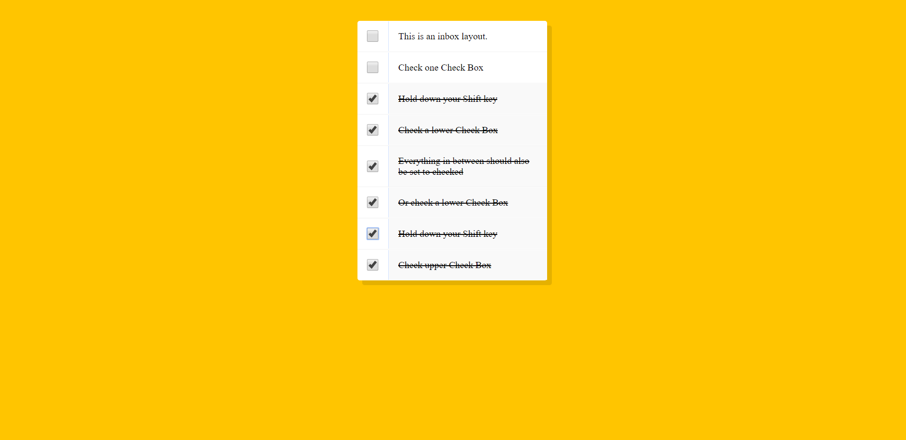

# JavaScript 30 Challenge. Day 10 Multiple Selection

## WHAT IT DOES
* Multiple selection of check boxes with pressed `SHIFT` key from top to bottom and from bottom to top
* Supports keyboard selection